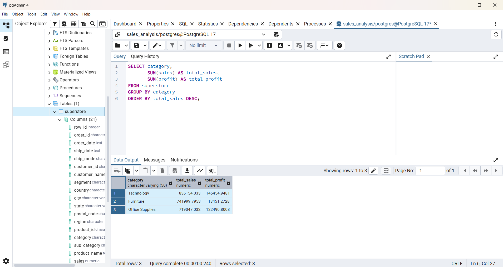
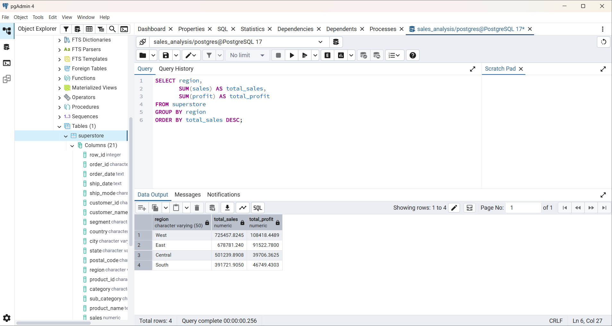
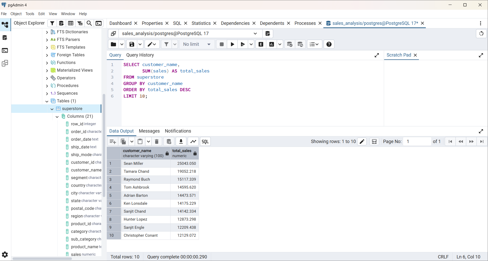

# SQL Sales Analysis Project

## Overview

Analyzed retail sales data using PostgreSQL and SQL to identify sales trends, profitability patterns, customer behavior, and regional performance.

## Tools Used

* PostgreSQL
* SQL
* pgAdmin 4

## Dataset

Sample Superstore Dataset

## Business Questions Answered

1. Which category generates the highest revenue?
2. Which category generates the highest profit?
3. Which customers contribute the most revenue?
4. Which products perform best?
5. How does profitability vary across categories and regions?

## Key Findings

### Category Analysis

* Technology generated the highest revenue.
* Technology generated the highest profit.
* Furniture produced high sales but comparatively low profit.

### Customer Analysis

* Revenue is concentrated among a small number of high-value customers.

### Profitability Analysis

* Office Supplies demonstrated strong profitability.
* Discounting may affect profit margins.

## Skills Demonstrated

* SQL Querying
* Data Cleaning
* Data Aggregation
* Business Analysis
* KPI Reporting
* Data Validation
* Insight Generation

## Project Structure

* README.md
* queries.sql
* insights.md
* screenshots/

## Author

Anju Davis

## Sample Outputs

### Category Analysis

### Region Analysis

### Top Customers

